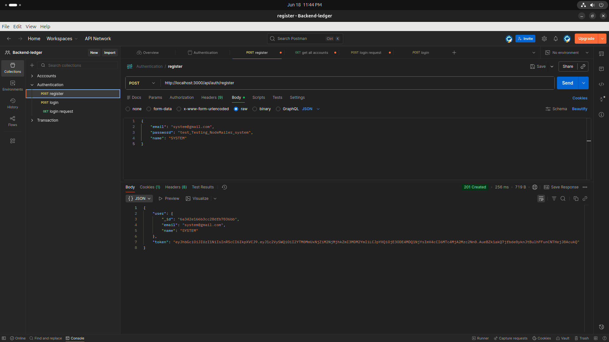
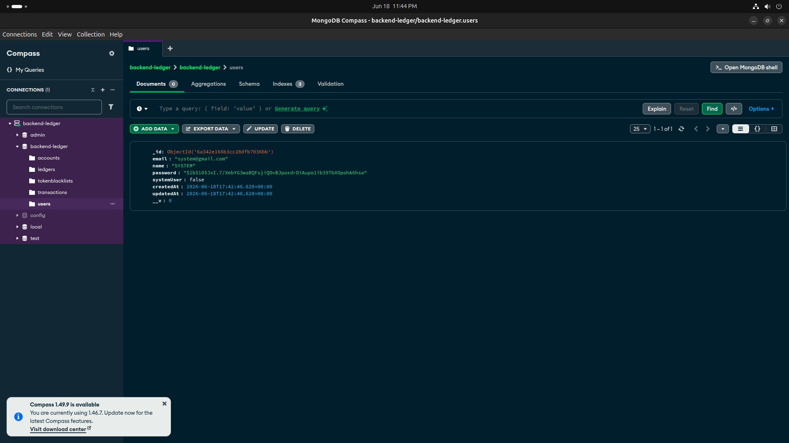
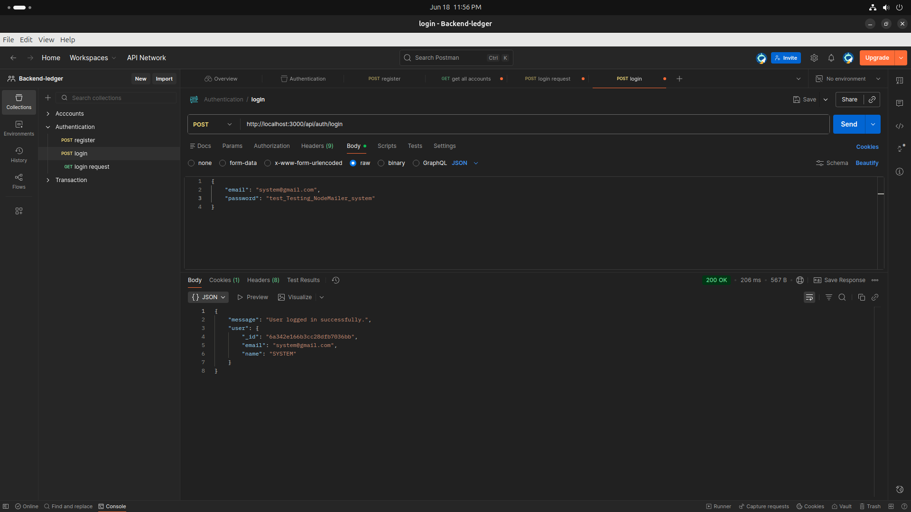
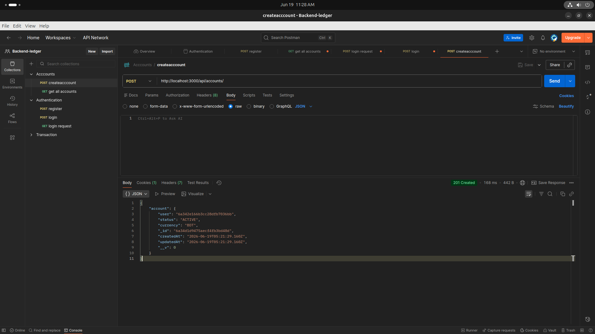
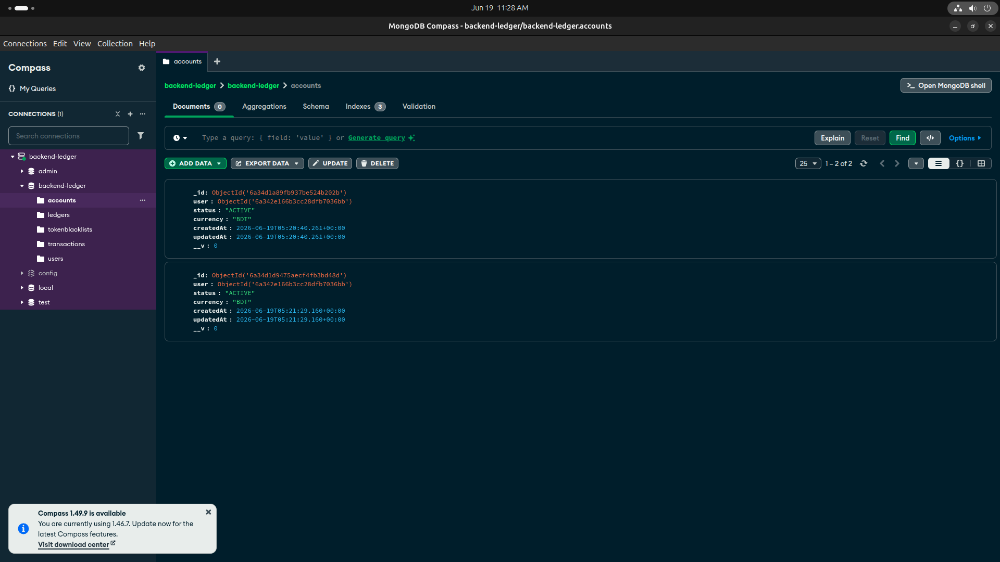
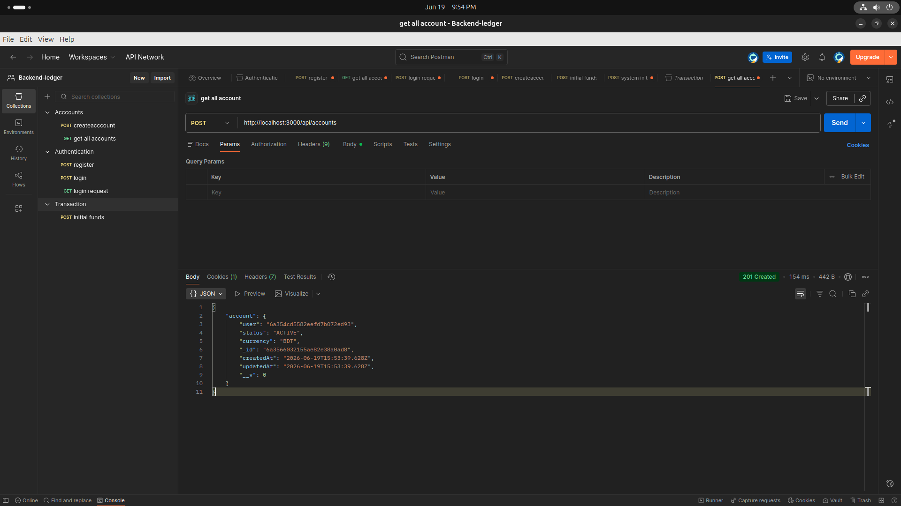
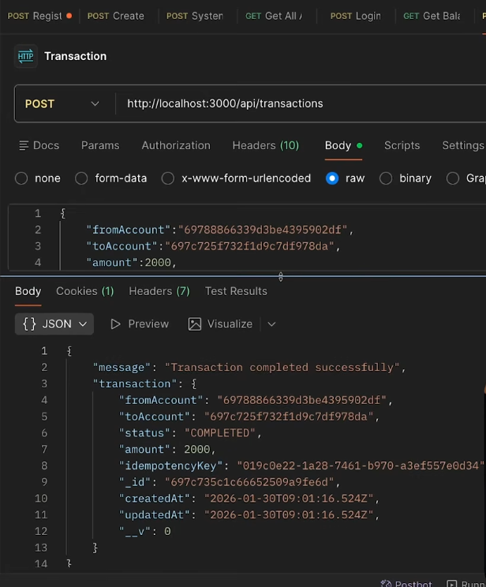
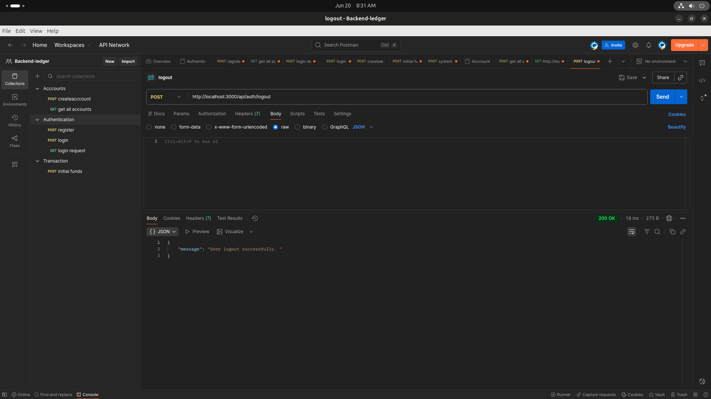

# 🏦 Advanced Backend Project — Bank Transaction System

A backend system that simulates real bank transfers using **Node.js**, **Express**, and **MongoDB**. It implements a **double-entry ledger** (the same accounting pattern real banks use), **idempotent transactions**, **JWT authentication with token blacklisting**, and **MongoDB transactions/sessions** to guarantee money never gets created or destroyed during a transfer.

---

## Table of Contents

- [Why a Ledger System?](#why-a-ledger-system)
- [Tech Stack](#tech-stack)
- [Project Structure](#project-structure)
- [Core Concepts](#core-concepts)
- [Data Models](#data-models)
- [Getting Started](#getting-started)
- [Environment Variables](#environment-variables)
- [API Reference](#api-reference)
- [The Money Transfer Flow](#the-money-transfer-flow)
- [Example Walkthrough (Postman + MongoDB)](#example-walkthrough-postman--mongodb)
- [Security Notes](#security-notes)
- [Known Limitations / TODO](#known-limitations--todo)

---

## Why a Ledger System?

Instead of storing a single `balance` field on each account (which is easy to corrupt with race conditions or bugs), this project records every movement of money as an **immutable ledger entry**:

- Every transfer creates **two** ledger entries: a `DEBIT` on the sender's account and a `CREDIT` on the receiver's account.
- An account's balance is never stored directly — it is **derived** on demand by summing all of its `CREDIT` and `DEBIT` ledger entries.
- Ledger entries can never be updated or deleted (enforced at the schema level), which keeps a permanent, tamper-evident audit trail — exactly how real-world accounting ledgers work.

## Tech Stack

| Layer            | Technology              |
|-------------------|--------------------------|
| Runtime           | Node.js                 |
| Web Framework     | Express 5               |
| Database          | MongoDB + Mongoose      |
| Auth              | JWT (jsonwebtoken) + httpOnly cookies |
| Password Hashing  | bcryptjs                |
| Email             | Nodemailer (Gmail OAuth2) |
| Dev Tooling       | nodemon                 |

## Project Structure

```
.
├── server.js                  # Entry point — starts DB connection & HTTP server
├── src/
│   ├── app.js                 # Express app setup & route mounting
│   ├── config/
│   │   └── db.js              # MongoDB connection (Mongoose)
│   ├── models/
│   │   ├── user.model.js          # User accounts (auth)
│   │   ├── account.model.js       # Bank accounts (one user can have many)
│   │   ├── transaction.model.js   # Transfer records (PENDING/COMPLETED/FAILED/REVERSED)
│   │   ├── ledger.model.js        # Immutable double-entry ledger (DEBIT/CREDIT)
│   │   └── blackList.model.js     # Revoked JWTs (for logout)
│   ├── controllers/
│   │   ├── auth.controller.js         # Register / Login / Logout
│   │   ├── account.controller.js      # Create account / list accounts / get balance
│   │   └── transaction.controller.js  # Transfer money / seed initial funds
│   ├── middleware/
│   │   └── auth.middleware.js     # JWT verification + system-user check
│   ├── routes/
│   │   ├── auth.routes.js
│   │   ├── account.routes.js
│   │   └── transaction.routes.js
│   └── services/
│       └── email.service.js   # Transactional emails (welcome, success, failure)
└── package.json
```

## Core Concepts

### 1. Double-Entry Ledger
Every transaction writes **two balanced ledger rows** (one debit, one credit) inside the same MongoDB session, so the books always balance. Balances are computed via a Mongoose aggregation pipeline (`Account.getBalance()`) rather than read from a stored field.

### 2. Idempotency
Every transfer request must include an `idempotencyKey`. If the same key is sent twice (e.g. due to a network retry from the client), the server detects the existing transaction and returns its current state instead of double-charging the account.

### 3. Atomicity via MongoDB Sessions
Creating the transaction record and its two ledger entries happens inside a MongoDB **session/transaction** (`mongoose.startSession()`), so either all writes succeed or none do — there's no scenario where a debit is recorded without its matching credit.

### 4. System User for Funding Accounts
A special `systemUser` flag on the `User` model marks an internal "bank" account that can inject initial funds into a new user's account (`/api/transaction/system/initial-funds`), gated behind a dedicated `authSystemUserMiddleware`.

### 5. JWT Auth with Blacklisting
On login, a JWT is issued and set as an httpOnly cookie. On logout, instead of just deleting the cookie, the token itself is stored in a `tokenBlackList` collection (with a TTL index that auto-expires it after 3 days) so a stolen/old token can't be replayed after logout.

## Data Models

### User
| Field | Type | Notes |
|---|---|---|
| `email` | String | unique, required, validated |
| `name` | String | unique, required |
| `password` | String | hashed with bcrypt before save, `select: false` |
| `systemUser` | Boolean | marks internal bank account, immutable, `select: false` |

### Account
| Field | Type | Notes |
|---|---|---|
| `user` | ObjectId → User | required |
| `status` | String | `ACTIVE` \| `FROZEN` \| `CLOSED` |
| `currency` | String | default `BDT` |

Has an instance method `getBalance()` that aggregates the ledger to compute the live balance.

### Transaction
| Field | Type | Notes |
|---|---|---|
| `fromAccount` / `toAccount` | ObjectId → Account | required |
| `amount` | Number | must be ≥ 0 |
| `status` | String | `PENDING` \| `COMPLETED` \| `FAILED` \| `REVERSED` |
| `idempotencyKey` | String | unique, required |

### Ledger
| Field | Type | Notes |
|---|---|---|
| `account` | ObjectId → Account | immutable |
| `transaction` | ObjectId → Transaction | immutable |
| `amount` | Number | immutable |
| `type` | String | `CREDIT` \| `DEBIT`, immutable |

All update/delete operations on the Ledger model are blocked at the schema level (`pre` hooks throw an error), enforcing append-only behavior.

### TokenBlackList
| Field | Type | Notes |
|---|---|---|
| `token` | String | unique |
| `createdAt` | Date | TTL-indexed, expires after 3 days |

## Getting Started

### Prerequisites
- Node.js (v18+ recommended)
- A MongoDB instance (local or Atlas)
- A Gmail account configured for OAuth2 (only needed if you want transactional emails to send)

### Installation

```bash
git clone https://github.com/csakib049/-Advanced-Backend-Project-Bank-Transaction-System-with-Node.js-Express-MongoDB-.git
cd -Advanced-Backend-Project-Bank-Transaction-System-with-Node.js-Express-MongoDB-
npm install
```

### Running the server

```bash
# Development (auto-restart on file changes)
npm run dev

# Production
npm start
```

By default the server listens on `PORT` from your `.env`, or `5000` if not set.

## Environment Variables

Create a `.env` file in the project root:

```env
PORT=5000
MONGO_URI=mongodb://localhost:27017/bank-transaction-system
JWT_SECRET=your_jwt_secret_here

# Email (Gmail OAuth2) — required only for transactional emails
EMAIL_USER=your_gmail_address@gmail.com
CLIENT_ID=your_google_oauth_client_id
CLIENT_SECRET=your_google_oauth_client_secret
REFRESH_TOKEN=your_google_oauth_refresh_token
```

> If you don't need outgoing emails for local testing, the app will still run — the email service will just log a connection error on startup, and email-sending calls will fail silently within their try/catch.

## API Reference

All protected routes require a valid JWT, sent either as an httpOnly cookie (`token`) or as a `Authorization: Bearer <token>` header.

### Auth — `/api/auth`

| Method | Endpoint | Auth | Description |
|---|---|---|---|
| POST | `/register` | Public | Create a new user, returns user + JWT cookie. Sends a welcome email. |
| POST | `/login` | Public | Authenticate with email/password, returns user + sets JWT cookie. |
| POST | `/logout` | Public | Blacklists the current token and clears the cookie. |

**Register — request body**
```json
{
  "email": "jane@example.com",
  "name": "Jane Doe",
  "password": "secret123"
}
```

**Login — request body**
```json
{
  "email": "jane@example.com",
  "password": "secret123"
}
```

### Accounts — `/api/accounts`

| Method | Endpoint | Auth | Description |
|---|---|---|---|
| POST | `/` | Required | Create a new bank account for the logged-in user. |
| GET | `/` | Required | List all accounts belonging to the logged-in user. |
| GET | `/balance/:accountID` | Required | Get the derived balance of a specific account (must belong to the requester). |

### Transactions — `/api/transaction`

| Method | Endpoint | Auth | Description |
|---|---|---|---|
| POST | `/` | Required | Transfer funds between two accounts. |
| POST | `/system/initial-funds` | System user only | Seed a new account with funds from the system account. |

**Create transaction — request body**
```json
{
  "fromAccount": "<accountId>",
  "toAccount": "<accountId>",
  "amount": 500,
  "idempotencyKey": "a-unique-client-generated-string"
}
```

**Response**
```json
{
  "message": "Transaction completed successfully",
  "transaction": {
    "_id": "...",
    "fromAccount": "...",
    "toAccount": "...",
    "amount": 500,
    "status": "COMPLETED",
    "idempotencyKey": "..."
  }
}
```

## The Money Transfer Flow

`POST /api/transaction/` follows these steps:

1. **Validate request** — ensure `fromAccount`, `toAccount`, `amount`, and `idempotencyKey` are present and both accounts exist.
2. **Check idempotency key** — if a transaction with this key already exists, short-circuit and return its current status instead of processing again.
3. **Check account status** — both accounts must be `ACTIVE`.
4. **Derive sender's balance** from the ledger and confirm sufficient funds.
5. **Start a MongoDB session/transaction.**
6. **Create the transaction record** with status `PENDING`.
7. **Write a `DEBIT` ledger entry** for the sender.
8. **Write a `CREDIT` ledger entry** for the receiver.
9. **Mark the transaction `COMPLETED`** and commit the session.
10. **Send a confirmation email** to the sender.

If any step inside the session fails, the whole operation is rolled back, leaving no partial debit/credit.

## Example Walkthrough (Postman + MongoDB)

The screenshots below show an end-to-end run of the API using Postman, with the corresponding MongoDB Compass state shown right after each write operation. All images live in [`assets/screenshots`](./assets/screenshots).

### 1. Register a user

`POST /api/auth/register` creates a user and immediately returns the user object plus a JWT.



The new document appears in the `users` collection, with the password stored as a bcrypt hash — never in plaintext.



### 2. Log in

`POST /api/auth/login` authenticates with email/password and returns the user (the JWT is also set as an httpOnly cookie).



### 3. Create a bank account

`POST /api/accounts/` (authenticated) creates a new `ACTIVE` account tied to the logged-in user.



The `accounts` collection now holds the new account document, linked to the user via the `user` field.



### 4. List accounts

`GET /api/accounts/` returns every account belonging to the authenticated user.



### 5. Transfer funds between accounts

`POST /api/transaction/` moves money from one account to another. The response shows the completed transaction, including its `idempotencyKey` and final `COMPLETED` status.



### 6. Log out

`POST /api/auth/logout` blacklists the current token so it can no longer be used, even if it hasn't expired yet.



> **Note:** Credentials, emails, and IDs shown in these screenshots are from a local test environment and are not real account details.

## Security Notes

- Passwords are hashed with bcrypt (cost factor 10) and never returned in queries by default (`select: false`).
- JWTs are stored in httpOnly cookies to reduce exposure to XSS.
- Logout invalidates the token server-side via a blacklist, rather than relying solely on the client deleting its cookie.
- Ledger entries are immutable at the schema level, preventing accidental or malicious tampering with the financial history.

## Known Limitations / TODO

- `createInitialFundsTransaction` currently contains a hard-coded artificial delay and lacks the same idempotency short-circuit / status checks as the main transfer flow — recommended to align it with `createTransaction` before production use.
- No automated test suite yet.
- No rate-limiting or request validation middleware (e.g. `express-validator`, `zod`) — input validation is currently manual inside each controller.
- No pagination on `GET /api/accounts`.
- Transaction reversal (`REVERSED` status) is defined in the schema but not yet implemented as an endpoint.

---

### License

ISC
